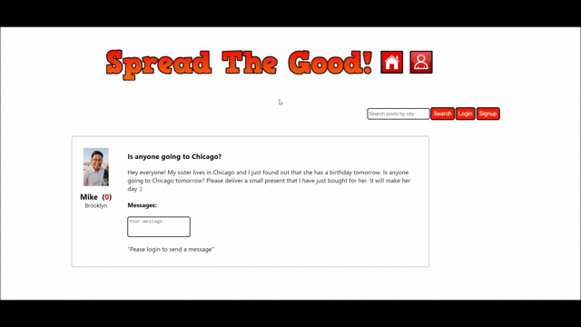

<h1 align="center">Spread The Good</h1>
<div align="center">
</img>
<p><i>In purpose of demo backend of the project seeded with a few fake user accounts and posts.</i> </p>
</div>
<h2>About The Project</h2>
<p>Social network for helping others.</p> 
<p>Users can list, search, message and increase karma score. </p>
<p><b>Backend:</b> https://github.com/yulia-2008/spread_the_good_backend</p>


<h2>Features</h2>
<p>- Creating an acoount. </p>
<p>- Searching posts by city.</p>
<p>- Loging in/Logging out.</p>
<p>- Listing posts.</p>
<p>- Editing/Deleting your posts.</p>
<p>- Helping on others posts by clicking "Offer Your Help".</p>
<p>- Users profile keeps tracks of posts you've helped to as well as posts you've created (active and completed) with the avatar of the User who helped on your post.</p>
<p>- Private messaging.</p>
<p>- Marking your post as "Completed" which increases karma_score of the User who helped you.</p>
<p>- Other awesome features yet to be implemented.</p>


<h2>Frontend Built With</h2>
<ul>
 <li> <b>React.js</b> </li>
 <li> Utilized <b>React Router</b> to establish a dynamic routing system through the web app </li>
 <li> Browser's <b>Local Storage</b> for implementing current user info persistance after refreshing a page.</li>
</ul>

<h2>Getting Started</h2>
<p><b>Instructions on setting up the project locally.</b> </p>
<p> 1. Make sure you have following tools installed on the system.</p>
<p>- Ruby 2.6.1 </p>
<p>- Rails 6.0.3.3 </p>
<p>- Postgresql </p>
<p> 2. In your terminal go to the directory where you want to clone this project.</p>

```sh
cd <FOLDER_NAME>
```

<p> 3.  Clone frontend and backend repos to the same folder.</p>

```sh
git clone  git@github.com:yulia-2008/spread_the_good_frontend.git
```

```sh
git clone  git@github.com:yulia-2008/spread_the_good_backend.git
```
<p> <b>Backend installation: </b> </p>

<p> 1. In <b>spread_the_good_backend/config/database.yml</b> file enter your postgres user for the project and password as shown below:</p>
 <div align="center">
 </img>
 </div>
 
 <p> 2. Start rails server on port 4000, make sure you are in the project backend directory.</p>
     
```sh
cd spread_the_good_backend
```

```sh
rails s -p4000
```
<p> <b>Frontend installation: </b></p>
 <p> 1. In your terminal go to frontend directory.</p>
 
```sh
cd spread_the_good_frontend
```

 <p> 2. Install NPM packages:</p>
 
```sh
npm install
```
 <p> 3. Install React Router:</p>

```sh
npm install react-router-dom
```
 <p> 4. Run the app:</p>

```sh
npm start
```
<p>5. Now you can visit the app on the URL http://localhost:3000 </p>


